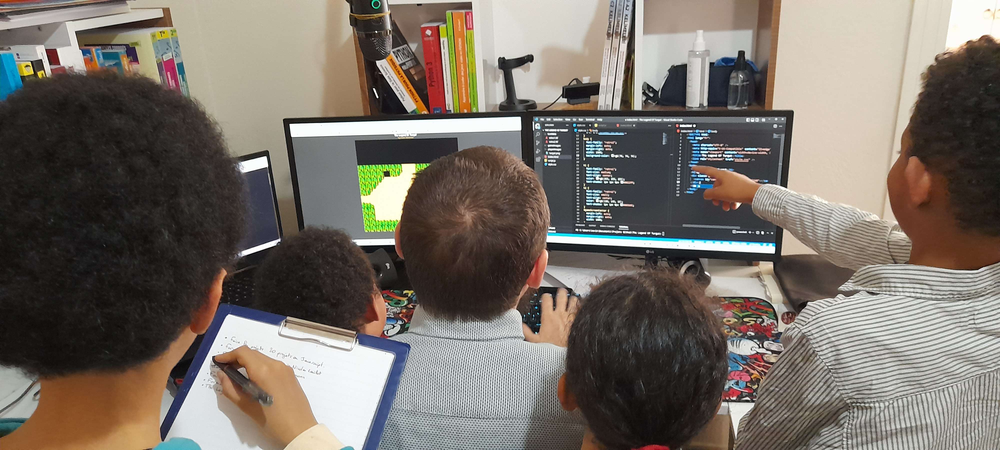

# ⚔️ The Legend Of Turgut ⚔️

## Présentation

"The Legend Of Turgut" est un jeu coder en 🗡️ HTML 🏹 CSS 🪓 JAVASCRIPT sans framework en utilisant Canvas.

En reconversion professionnelle depuis le mois de mai 2020, je partage avec vous ce projet ludique. Un projet jeu qui me permet de coder avec l'aide de mes enfants. J'ai utilisé Phaser.js, Pygame et Unity mais je suis revenu a une version en JavaScript qui est le language le plus utilisé lors de ma formation.

    <a href= "https://kevinozkaraca.github.io/Turgut_Javascript/"> ⚔️ Cliquer ici pour jouer ⚔️</a>

Le jeu vidéo est un moyen ludique et plaisant pour partager et faire découvrir la programmation. J'ai toujours aimé partager mes connaissances et j'espère que ce projet sucitera autant de plaisir dans le jeu que j'ai à le concevoir ! Alors merci à vous...

## Qui est Turgut ?

Turgut est un personnage fictif d'anatolie, à l'époque où les peuples turcs vivaient encore comme des nomades. L'idée d'en faire un jeu d'aventure est simple : La Turquie est un pays chargé d'histoire, le meilleur endroit pour un RPG (jeu d'aventure). Le choix des graphismes en pixel, qui rappel le retro gaming est la pour me faciliter la tache et me focaliser sur le code.

J'essaie de réaliser par moi même l'ensemble des éléments du jeu pour plus de cohérence. Le son, les images et le code sont réalisés par mes soins ou adaptés à mes besoins.

Les histoires de Turgut vous ferront décrouvir l'histoire et la culture de Turquie.

J'ai réalisé le personnage Turgut grace au logiciel PISKEL. En me référant à link dans le jeu The Legend of Zelda Une des grande référence du retro-gaming dans les jeux d'aventure. A l'époque, ce jeu se jouait avec une manette à deux boutons seulement et sans la possibilité de bouger en diagonal.
 

## L'équipe de travail

 

   
    
        
        
        
        
        
        
        
        
      
 

